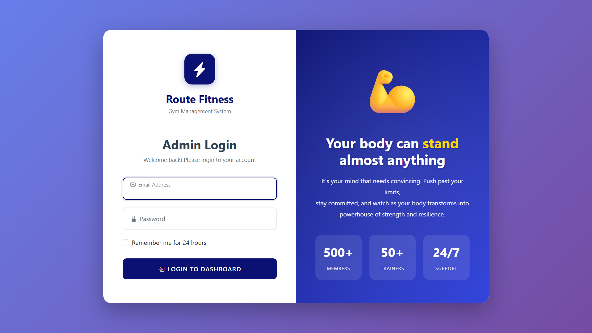
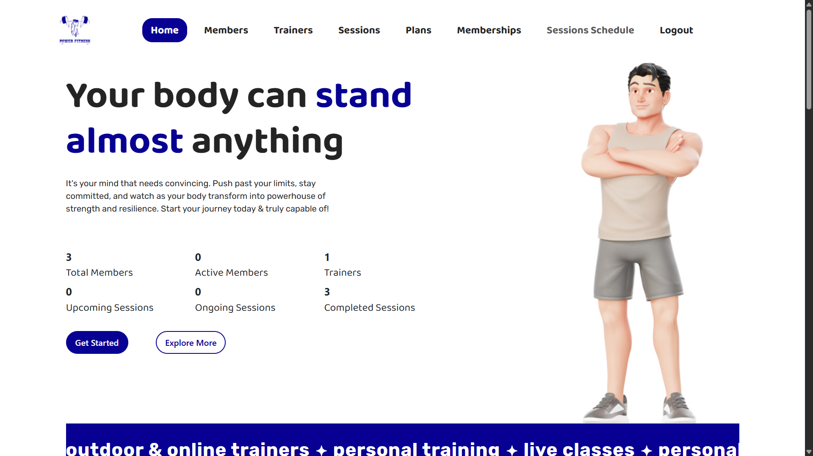
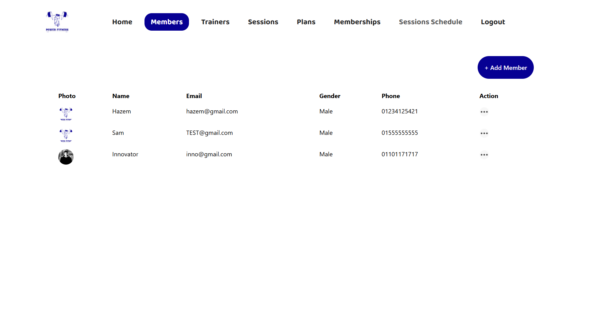
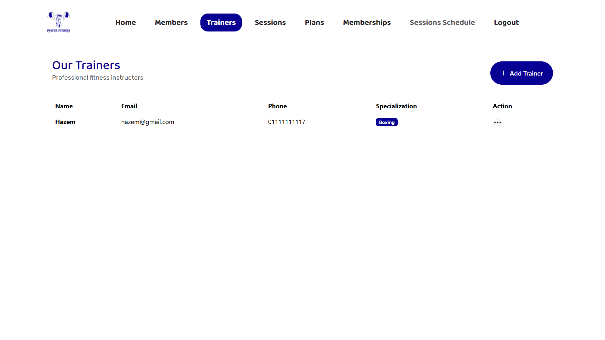
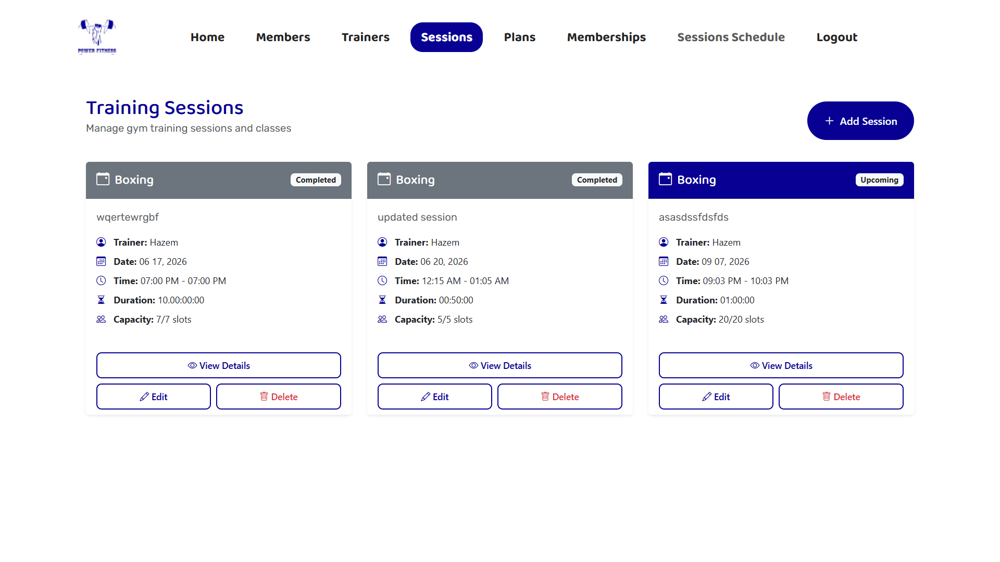
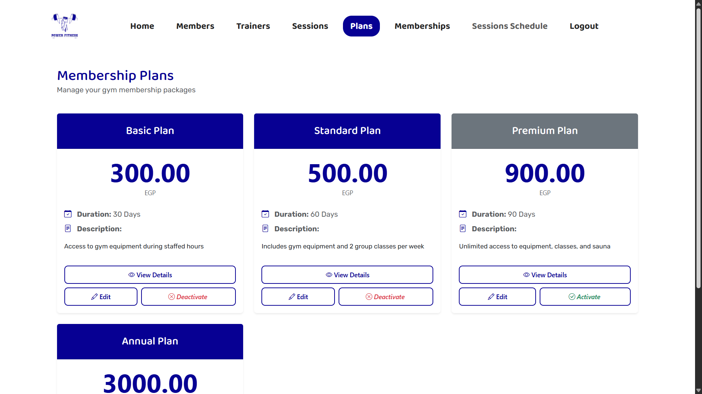

# Gym Management System (ASP.NET MVC)

A web application for managing gym operations — members, trainers, sessions, and membership plans — built with ASP.NET Core MVC using a clean layered (N-tier) architecture.

> Built as part of my training with **Route Academy**.

## Features

- **Admin Authentication** — secure login via ASP.NET Core Identity
- **Dashboard** — live overview of total/active members, trainers, and session stats
- **Member Management** — add, view, and manage members with photo uploads and health records
- **Trainer Management** — manage trainer profiles and specializations (e.g. Boxing)
- **Session Management** — create and track training sessions with date, time, duration, capacity, and status (Upcoming / Completed)
- **Membership Plans** — tiered plans (Basic, Standard, Premium, Annual) with pricing, duration, and descriptions, with activate/deactivate controls
- **File Uploads** — member photo attachments

## Tech Stack

- **Framework:** ASP.NET Core MVC (.NET 9)
- **Database:** SQL Server (via Entity Framework Core 9)
- **Auth:** ASP.NET Core Identity
- **Object Mapping:** AutoMapper
- **Architecture:** 3-layer separation
  - `GymSys.PL` — Presentation layer (MVC controllers, views, static assets)
  - `GymSys.BL` — Business logic layer (services, view models, mapping profiles)
  - `GymSys.DAL` — Data access layer (EF Core models, repositories, unit of work, DB context)
- **Patterns:** Repository + Unit of Work, Generic Repository, Result pattern for service responses

## Screenshots

| Login | Dashboard |
|---|---|
|  |  |

| Members | Trainers |
|---|---|
|  |  |

| Sessions | Membership Plans |
|---|---|
|  |  |

## Getting Started

### Prerequisites

- [.NET 9 SDK](https://dotnet.microsoft.com/download)
- SQL Server (LocalDB or full instance)
- Visual Studio 2022 (or another .NET-compatible IDE)

### Setup

1. Clone the repository
   ```bash
   git clone https://github.com/hazem-eltahan/Gym-Management-System-MVC.git
   ```
2. Open `GNET38-MVC02.sln` in Visual Studio
3. Update the connection string in `GymSys.PL/appsettings.json` if needed:
   ```json
   "ConnectionStrings": {
     "DefaultConnection": "Server=.;Database=GymDb;Trusted_Connection=true;TrustServerCertificate=true"
   }
   ```
4. Run the project — database migrations and seeding are applied automatically on startup

## Project Structure

```
GymSys.PL/    → Controllers, Views, wwwroot (UI/entry point)
GymSys.BL/    → Services, ViewModels, AutoMapper profiles (business logic)
GymSys.DAL/   → Models, Repositories, DbContext, Migrations (data access)
```

## Acknowledgements

Built as a learning project while following along with **Route Academy**'s ASP.NET training program.
